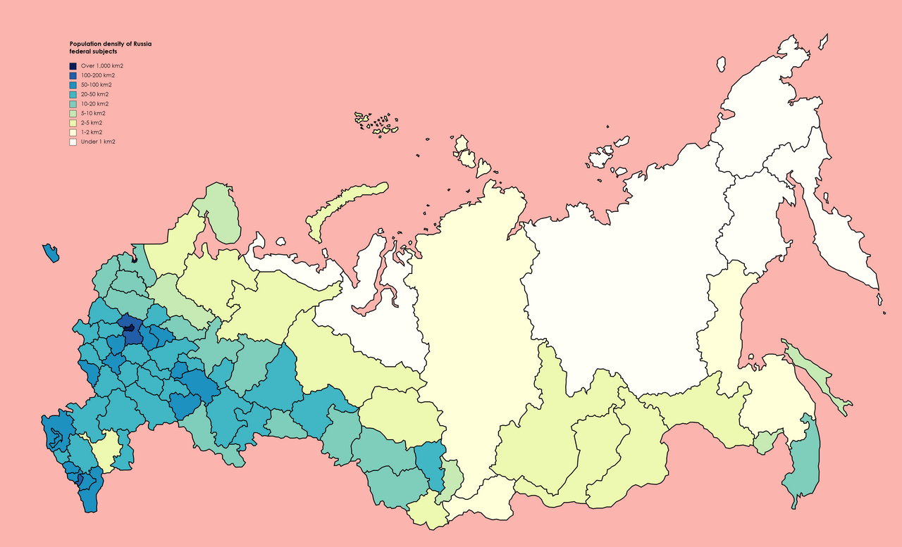

# Проектирование высоконагруженного сервиса стримингового кинотеатра - Кинопоиск
## Часть 1. Тема, функционал и аудитория

### Тема
Тема данной курсовой работы - проектирование высоконагруженного сервиса стримингового кинотеатра на примере [Кинопоиска](https://www.kinopoisk.ru/)
### Целевая аудитория
- Общее число пользователей - 60 млн [^1]
    - из них 18 млн - смотрящих по мультиподписке Яндекс Плюс в месяц  [^1]
    - Один подписчик проводит в среднем 16 дней в месяц пользуюясь Кинопоиском [^1]
    - DAU = 18 млн * 16 / 30 =  9.6 млн

### Ключевой функционал 
- Просмотр каталога фильмов, сериалов и телеканалов
- Поиск по каталогу
- Рекомендации
- Возможность добавить фильм или сериал в Избранное (“Буду смотреть”)
- Воспроизведение видео
- Регистрация и авторизация пользователей
- Возможность оставить оценку, отзыв, рецензию на фильм, сериал

### Ключевые продуктовые решения
- Кроссплатформенный доступ к фильмам, сериалам и телеканалам
- Рекомендательная система для каждого пользователя [^2]
- Сквозная синхронизация прогресса и списков между устройствами
- Тяжелый видеоконтент выносится в CDN [^3]

## Часть 2. Расчёт нагрузки

### Продуктовые метрики

### Сводная таблица продуктовых метрик

| Метрика | Значение |
|---|---:|
| MAU (платформа) | 60 000 000 |
| MAU (смотрящие) | 18 000 000 |
| DAU | 9 600 000 |
| Количество единиц контента в библиотеке | ~80 000 [^6] |
| Средний размер хранилища на пользователя (без медиа) | ~24 КБ |

### Средний размер хранилища пользователя (по типам)

| Тип данных | Среднее количество на пользователя | Оценка размера записи | Размер на пользователя |
|---|---:|---:|---:|
| Профиль пользователя + настройки | 1 | ~2 КБ | ~2 КБ |
| Сессии / устройства / токены | 2–3 | ~1 КБ | ~3 КБ |
| Избранное (“Буду смотреть”) | ~30 тайтлов | ~64 Б | ~2 КБ |
| Прогресс просмотра + история | ~200 записей | ~64 Б | ~13 КБ |
| Оценки / отзывы / рецензии (в среднем по всем пользователям) | — | — | ~1–5 КБ |
| **Итого на пользователя** | — | — | **~24 КБ** |

### Среднее количество действий пользователя по типам в день (MVP)

| Тип действия | Значение (на 1 DAU в день) | Комментарий |
|---|---:|---|
| Просмотр каталога (лента/подборки/пагинация) | 20 | Несколько открытий лент и подгрузок |
| Поиск по каталогу | 2 | Только чтобы выбрать контент |
| Добавление/удаление в избранное | 0.2 | Не каждый день и не у всех |
| Старт воспроизведения | 1 | Один запуск просмотра в день |
| Авторизация / refresh | 0.1 | Не каждый день |
| Оценка / отзыв / рецензия | 0.03 | Редкое действие |
| Сохранение прогресса просмотра (раз в 30 сек) | 120 | При 60 мин просмотра в день |

### Технические метрики

## Размер хранения в разбивке по типам данных

### Пользовательские данные (БД)

- `Объём пользовательских данных = MAU платформы × 24 КБ`
- `60 000 000 × 24 КБ = 1 440 000 000 КБ ≈ 1.44 ТБ`

### Каталог, поиск и медиа

#### Каталог и поисковый индекс

Известно:
- библиотека онлайн-кинотеатра: около **80 тыс. единиц контента** [^6]

Оценка метаданных:
- метаданные + связи + описания: `~10 КБ` на единицу контента
- поисковый индекс: `~2–3x` от объёма метаданных

| Тип данных | Количество | Оценка | Итог |
|---|---:|---:|---:|
| Метаданные каталога | 80 000 | ~10 КБ / единицу | ~0.8 ГБ |
| Поисковый индекс | 80 000 | ~2–3x от метаданных | ~2 ГБ |
| Постеры/изображения (основные копии) | 80 000 | ~0.5–1 МБ | ~40–80 ГБ |

#### Видеоконтент (порядок величины)

Для оценки объёма видеобиблиотеки используется:
- около `80 000` единиц контента [^6]
- диапазон средней длительности одной единицы контента: `45–90 минут`  
  (единица контента включает фильмы, серии и другие типы контента)
- в качестве ориентира по ABR-профилям — пример HLS bitrate ladder из AWS:  
  `7.8, 6, 4.5, 3, 2, 1.1, 0.8, 0.4, 0.2 Mbps` [^5]

Суммарный битрейт набора ABR-профилей:
- `7.8 + 6 + 4.5 + 3 + 2 + 1.1 + 0.8 + 0.4 + 0.2 = 25.8 Мбит/с`

Размер одной единицы контента:
- при 45 мин:
  - `25.8 Мбит/с × 2700 с / 8 ≈ 8.71 ГБ`
- при 90 мин:
  - `25.8 Мбит/с × 5400 с / 8 ≈ 17.42 ГБ`

Общий объём видеобиблиотеки:
- при 45 мин: `80 000 × 8.71 ГБ ≈ 697 ТБ`
- при 90 мин: `80 000 × 17.42 ГБ ≈ 1 394 ТБ ≈ 1.39 ПБ`

Итого порядок объёма видеоконтента:
- **`~697 ТБ – 1.39 ПБ`**

### Прирост дискового пространства

Для планирования ёмкости хранилищ оценивается годовой прирост по основным категориям данных:
- видеоконтент,
- пользовательские данные,
- постеры/изображения.

#### Прирост пользовательских данных

По данным Кинопоиска, в 2025 году количество смотрящих подписчиков выросло на **29% год к году**[^1].

Оценим размер аудитории годом ранее:
- `18 000 000 / 1.29 ≈ 13 953 488`

Тогда прирост смотрящих подписчиков за год:
- `18 000 000 - 13 953 488 ≈ 4 046 512 пользователей`

При среднем размере пользовательских данных `24 КБ` на пользователя годовой прирост пользовательских данных составит:
- `4 046 512 × 24 КБ ≈ 97 116 288 КБ ≈ 97 ГБ`

#### Прирост видеоконтента

- **80 тыс. единиц контента** (2020) [^6];
- около **100 тыс. единиц контента** (2023) (данные были упомянуты вскользь и без точных цифр) [^7].

Оценка среднего прироста по количеству единиц контента:
- `100 000 - 80 000 = 20 000` единиц контента
- период между публикациями: примерно `3 года`
- `20 000 / 3 ≈ 6 667` единиц контента в год

Тогда годовой прирост видеохранилища составит:

- при 45 мин:
  - `6 667 × 8.71 ГБ ≈ 58 077 ГБ ≈ 58.1 ТБ/год`
- при 90 мин:
  - `6 667 × 17.42 ГБ ≈ 116 153 ГБ ≈ 116.2 ТБ/год`

#### Постеры/изображения

- минимальная оценка:
  - `6 667 × 0.5 МБ ≈ 3 333.5 МБ ≈ 3.3 ГБ/год`
- максимальная оценка:
  - `6 667 × 1 МБ ≈ 6 667 МБ ≈ 6.7 ГБ/год`

## Сетевой трафик

Трафик делится на два больших класса:
1. **API / управляющий трафик** (каталог, поиск, избранное, авторизация, прогресс)
2. **Видеотрафик (CDN)**

### Параметры для расчёта видеотрафика

| Параметр | Значение | Комментарий |
|---|---:|---|
| Средняя длительность просмотра в день | 60 мин | Оценка для активного смотрящего пользователя |
| Средний битрейт потока | 3 Мбит/с | Усреднение по качествам |
| Длительность сегмента | 6 сек | Типичный порядок для HLS/DASH [^4] |
| Коэффициент пиковости | 2 | Пик / среднее по суткам |

### Видеотрафик (CDN)

#### Средняя одновременность зрителей

- `Средняя одновременность = DAU × время просмотра в день / 86400`

Расчёт:
- `9 600 000 × 3600 / 86400 = 400 000`

#### Пиковая одновременность зрителей

- `Пиковая одновременность = 400 000 × 2 = 800 000`

#### Средняя и пиковая полоса видеотрафика

Расчёт:
- средняя: `400 000 × 3 Мбит/с = 1200 Гбит/с`
- пиковая: `800 000 × 3 Мбит/с = 2400 Гбит/с`

#### Суммарный суточный видеотрафик

Расчёт:
- `9.6 млн × 60 мин × 3 Мбит/с ≈ 12.96 ПБ/сутки`

## RPS в разбивке по типам запросов (средний и пиковый)

- `Запросов в сутки = DAU × число действий в день`
- `Средний RPS = запросов в сутки / 86400`
- `Пиковый RPS = средний RPS × 2`

### RPS для backend API (без видео-сегментов)

| Тип запроса | Действий на пользователя в день | Запросов в сутки | Средний RPS | Пиковый RPS |
|---|---:|---:|---:|---:|
| Просмотр каталога | 20 | 192 000 000 | 2 222.22 | 4 444.44 |
| Поиск по каталогу | 2 | 19 200 000 | 222.22 | 444.44 |
| Избранное (add/remove) | 0.2 | 1 920 000 | 22.22 | 44.44 |
| Старт воспроизведения | 1 | 9 600 000 | 111.11 | 222.22 |
| Авторизация / refresh | 0.1 | 960 000 | 11.11 | 22.22 |
| Оценка / отзыв / рецензия | 0.03 | 288 000 | 3.33 | 6.67 |
| Сохранение прогресса просмотра | 120 | 1 152 000 000 | 13 333.33 | 26 666.67 |
| **Итого API (без CDN)** | — | **1 375 968 000** | **15 925.56** | **31 851.11** |

### RPS для видео-сегментов (CDN)

При длительности сегмента `6 сек` [^4] один активный зритель запрашивает примерно `1/6` сегмента в секунду.

Расчёт:
- средний RPS сегментов: `400 000 / 6 ≈ 66 666.67`
- пиковый RPS сегментов: `800 000 / 6 ≈ 133 333.33`

| Тип запроса | Средний RPS | Пиковый RPS |
|---|---:|---:|
| Запросы видео-сегментов (CDN) | 66 666.67 | 133 333.33 |

## Сводная таблица трафика (пик / суточный)

### API / управляющий трафик (без видео)

Для API-трафика используется укрупнённая оценка среднего обмена на один запрос:
- **~8 КБ** на запрос (с учётом смеси типов запросов)

Расчёт:
- `1 375 968 000 × 8 КБ ≈ 11.01 ТБ/сутки`
- средняя полоса: `~1.02 Гбит/с`
- пиковая полоса: `~2.04 Гбит/с`

| Тип трафика | Средняя полоса | Пиковая полоса | Суточный трафик |
|---|---:|---:|---:|
| API / управляющий (без видео) | ~1.02 Гбит/с | ~2.04 Гбит/с | ~11.01 ТБ/сутки |

### Видеотрафик (CDN)

| Тип трафика | Средняя полоса | Пиковая полоса | Суточный трафик |
|---|---:|---:|---:|
| Видео-сегменты (CDN) | ~1200 Гбит/с | ~2400 Гбит/с | ~12.96 ПБ/сутки |

## Часть 3. Глобальная балансировка нагрузки

### Функциональное разбиение по доменам

Для упрощения глобальной балансировки и независимого масштабирования разных типов нагрузки выделим домены по функциям:

- `www.kinopoisk.ru` — веб-интерфейс сервиса;
- `api.kinopoisk.ru` — backend API (каталог, поиск, избранное, авторизация, прогресс просмотра, отзывы/оценки);
- `cdn.kinopoisk.ru` — раздача видео-сегментов (HLS/DASH) через CDN;
- `img.kinopoisk.ru` — постеры, изображения, миниатюры;
- `static.kinopoisk.ru` — JS/CSS/шрифты и прочая статика.

### Обоснование расположения ДЦ

При выборе расположения региональных площадок будем ориентироваться на:
- географическую протяжённость РФ;
- концентрацию населения по федеральным округам;
- необходимость снижения задержки;
- сокращение межрегионального транзита;
- приближение видеоконтента к пользователю.

В учебной модели для сервиса Кинопоиск целесообразно выделить следующие региональные узлы:
- **Москва**
- **Санкт-Петербург**
- **Ростов-на-Дону**
- **Екатеринбург**
- **Новосибирск**
- **Владивосток**

При этом следует различать:
- **региональные ДЦ** — для backend-нагрузки (`www`, `api`, часть `img/static`);
- **точки присутствия CDN (PoP)** — для раздачи видео и медиа ближе к пользователю.

В данной работе для упрощения расчёта предполагается, что backend-ДЦ и крупные CDN-узлы расположены в одних и тех же макрорегионах.

Такое размещение покрывает основные макрорегионы РФ:

- **Москва** — крупнейший сетевой и пользовательский узел; обслуживает значительную часть Центральной России и остаётся основным агрегирующим центром;
- **Санкт-Петербург** — отдельный узел для Северо-Запада (СЗФО), снижает нагрузку на московский регион;
- **Ростов-на-Дону** — южный узел для ЮФО и части СКФО, уменьшает зависимость южных регионов от Москвы;
- **Екатеринбург** — опорный узел для Урала и части Поволжья;
- **Новосибирск** — межрегиональный узел для Сибири;
- **Владивосток** — узел для Дальнего Востока, уменьшающий задержку для удалённых регионов.

Таким образом, выбранная схема лучше покрывает не только крупнейшие города, но и основные населённые и сетевые макрорегионы России. Добавление Ростова-на-Дону позволяет разгрузить Москву по южному направлению и сделать учебную модель менее московоцентричной.

### Распределение запросов по дата-центрам

Ранее получены пиковые значения нагрузки:
- **API (без CDN):** `31 851.11 RPS`
- **CDN (видео-сегменты):** `133 333.33 RPS`
- **Пиковая полоса видеотрафика:** `2400 Гбит/с`

Для оценки примем распределение нагрузки по ДЦ на основе численности населения федеральных округов РФ с привязкой к ближайшим межрегиональным узлам:
- **Москва** обслуживает `ЦФО + часть ПФО`
- **Санкт-Петербург** обслуживает `СЗФО`
- **Ростов-на-Дону** обслуживает `ЮФО + часть СКФО`
- **Екатеринбург** обслуживает `УрФО + часть ПФО`
- **Новосибирск** обслуживает `СФО`
- **Владивосток** обслуживает `ДФО + часть СКФО/восточного трафика в аварийных сценариях не принимает`

Для учебной оценки примем следующее распределение трафика:
- Москва — `45%`
- Санкт-Петербург — `9.5%`
- Ростов-на-Дону — `10%`
- Екатеринбург — `17%`
- Новосибирск — `12.5%`
- Владивосток — `6%`

#### Разбиение пиковой нагрузки по ДЦ

| ДЦ | Доля | API (пиковый RPS) | CDN (пиковый RPS) | Пиковая полоса CDN |
|---|---:|---:|---:|---:|
| Москва | 45.0% | ~14 333 | ~60 000 | ~1080 Гбит/с |
| Санкт-Петербург | 9.5% | ~3 026 | ~12 667 | ~228 Гбит/с |
| Ростов-на-Дону | 10.0% | ~3 185 | ~13 333 | ~240 Гбит/с |
| Екатеринбург | 17.0% | ~5 415 | ~22 667 | ~408 Гбит/с |
| Новосибирск | 12.5% | ~3 981 | ~16 667 | ~300 Гбит/с |
| Владивосток | 6.0% | ~1 911 | ~8 000 | ~144 Гбит/с |

### Схема DNS-балансировки

Для выбора ближайшего или наиболее подходящего ДЦ используем **latency-based DNS** в сочетании с **Weighted GSLB**:

- клиент обращается к домену (`www`, `api`, `img`, `static`);
- DNS определяет подходящий регион;
- с учётом весов, health checks и доступности возвращается IP нужного ДЦ;
- используется короткий TTL (`30–60 сек`) для ускоренного переключения при аварии.

DNS-балансировка подходит для:
- `www.kinopoisk.ru`
- `api.kinopoisk.ru`
- `img.kinopoisk.ru`
- `static.kinopoisk.ru`

### Схема Anycast-балансировки

Для видеотрафика (`cdn.kinopoisk.ru`) целесообразно использовать **BGP Anycast** на edge-уровне CDN:

- один и тот же IP анонсируется из нескольких точек присутствия;
- пользовательский трафик направляется в ближайшую точку по маршрутам BGP;
- это снижает задержку и ускоряет старт загрузки видео-сегментов;
- далее внутри выбранного региона запрос обслуживается локальным CDN-кэшем или сервером.

### Механизм регулировки трафика между ДЦ

Для управления нагрузкой между ДЦ используется:

1. **Весовая DNS-балансировка (Weighted GSLB)**  
   Позволяет менять долю входящего трафика по ДЦ, например при плановых работах или частичной перегрузке площадки.

2. **Health checks**  
   При деградации или отказе ДЦ он автоматически убирается из DNS-выдачи для новых клиентов.

3. **Failover в соседний регион**  
   Запросы перенаправляются в ближайший по задержке ДЦ:
   - Москва ↔ Санкт-Петербург
   - Москва ↔ Ростов-на-Дону
   - Екатеринбург ↔ Новосибирск
   - Владивосток ↔ Новосибирск

4. **Плавное снижение веса при плановом выводе ДЦ**  
   Если площадку нужно временно отключить, её вес постепенно уменьшается до нуля, после чего она исключается из DNS-выдачи.

## Часть 4. Локальная балансировка нагрузки

### Схема балансировки

Внутри дата-центра используется двухуровневая схема балансировки для backend-трафика и отдельный ingress-контур для CDN.

**L4-балансировщик:**

| Параметр | Описание |
| --- | --- |
| **Реализация** | LVS / HAProxy |
| **Режим работы** | Распределение входящих TCP/TLS-соединений между узлами L7 или CDN-cache |
| **Резервирование** | Схема **N + 1** |

**L7-балансировщик:**

| Параметр | Описание |
| --- | --- |
| **Реализация** | Кластер nginx / Envoy |
| **Функции** | SSL Termination, маршрутизация запросов по backend-сервисам |
| **Резервирование** | Схема **N + 1** |

Для CDN используется схема:

`Клиент → Anycast / edge ingress → L4 → CDN-cache`

### Расчёт количества балансировщиков

Расчёт выполнен для наиболее загруженного дата-центра — **Москва**.

- **Пиковый API-трафик:** `~0.92 Гбит/с`
- **Пиковая API-нагрузка:** `~14 333 RPS`
- **Пиковый CDN-трафик:** `~1080 Гбит/с`

#### 1. Расчёт узлов L4 для API

Целевая конфигурация — серверы с интерфейсом **25GbE**.  
Ограничитель — пропускная способность сети.

**Расчёт активных узлов:**

`0.92 / 25 ≈ 0.04 → 1 сервер`

Для отказоустойчивости принимаем минимум **2 активных узла**.

С учётом резервирования **N + 1**:

`2 + 1 = 3 сервера`

**Итого:** 3 сервера.

#### 2. Расчёт узлов L7 для API

Ограничитель — **SSL Termination**.

Примем производительность одного L7-узла:
- **10 000 CPS**

**Расчёт активных узлов:**

`14 333 / 10 000 ≈ 1.43 → 2 сервера`

С учётом резервирования **N + 1**:

`2 + 1 = 3 сервера`

**Итого:** 3 сервера.

#### 3. Расчёт ingress-узлов для CDN

Целевая конфигурация — серверы с интерфейсом **100GbE**.  
Ограничитель — пропускная способность сети.

**Расчёт активных узлов:**

`1080 / 100 = 10.8 → 11 серверов`

С учётом резервирования **N + 1**:

`11 + 1 = 12 серверов`

**Итого:** 12 серверов.

### Итоговая конфигурация оборудования

| Уровень | Количество | Конфигурация узла | Тип резервирования |
| --- | --- | --- | --- |
| **L4 (API)** | 3 | CPU 8 Cores, NIC 25GbE | N + 1 |
| **L7 (API)** | 3 | CPU 16 Cores, NIC 25GbE | N + 1 |
| **L4 / ingress (CDN)** | 12 | CPU 8–16 Cores, NIC 100GbE | N + 1 |

## Список источников
[^1]: [Что смотрели, о чем читали и какие билеты покупали на Кинопоиске в 2025 году](https://www.kinopoisk.ru/media/article/4012180/)
[^2]: [Как рекомендации стримингов понимают ваши guilty pleasures. Объясняем на примере алгоритмов Кинопоиска](https://www.kinopoisk.ru/media/article/4012130)
[^3]: [Медиаплатформа (Yandex Infrastructure)](https://infra.yandex.ru/mediaplatforma)
[^4]: [MPEG-DASH / HLS segment duration overview (OTTVerse)](https://ottverse.com/mpeg-dash-video-streaming-the-complete-guide/)
[^5]: [Пример HLS bitrate ladder (AWS Media Blog)](https://aws.amazon.com/blogs/media/how-to-filter-live-streaming-renditions-by-device-type-at-the-edge/)
[^6]: [Кинопоиск: более 9000 фильмов/сериалов/мультфильмов и около 80 тысяч единиц контента](https://www.kinopoisk.ru/media/news/4003262/)
[^7]: [Кинопоиск о регулировании онлайн-кинотеатров](https://www.kinopoisk.ru/media/article/4008153/)