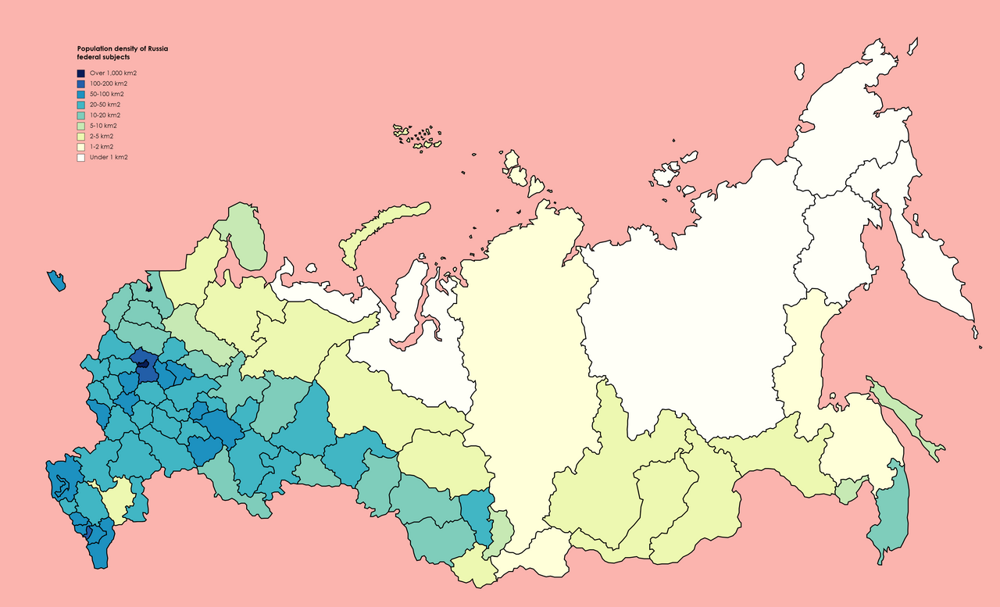
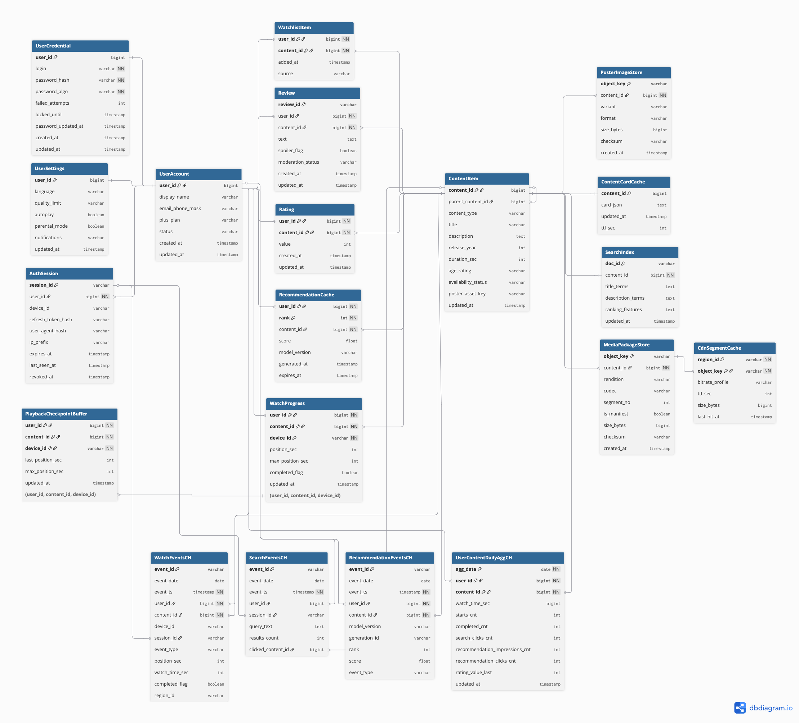

# Проектирование высоконагруженного сервиса стримингового кинотеатра - Кинопоиск
## Часть 1. Тема, функционал и аудитория

### Тема
Тема данной курсовой работы - проектирование высоконагруженного сервиса стримингового кинотеатра на примере [Кинопоиска](https://www.kinopoisk.ru/)
### Целевая аудитория
- Общее число пользователей - 60 млн [^1]
    - из них 18 млн - смотрящих по мультиподписке Яндекс Плюс в месяц  [^1]
    - Один подписчик проводит в среднем 16 дней в месяц пользуюясь Кинопоиском [^1]
    - DAU = 18 млн * 16 / 30 =  9.6 млн

### Ключевой функционал 
- Просмотр каталога фильмов, сериалов и телеканалов
- Поиск по каталогу
- Рекомендации
- Возможность добавить фильм или сериал в Избранное (“Буду смотреть”)
- Воспроизведение видео
- Регистрация и авторизация пользователей
- Возможность оставить оценку, отзыв, рецензию на фильм, сериал

### Ключевые продуктовые решения
- Кроссплатформенный доступ к фильмам, сериалам и телеканалам
- Рекомендательная система для каждого пользователя [^2]
- Сквозная синхронизация прогресса и списков между устройствами
- Тяжелый видеоконтент выносится в CDN [^3]

## Часть 2. Расчёт нагрузки

### Продуктовые метрики

### Сводная таблица продуктовых метрик

| Метрика | Значение |
|---|---:|
| MAU (платформа) | 60 000 000 |
| MAU (смотрящие) | 18 000 000 |
| DAU | 9 600 000 |
| Количество единиц контента в библиотеке | ~80 000 [^6] |
| Средний размер хранилища на пользователя (без медиа) | ~24 КБ |

### Средний размер хранилища пользователя (по типам)

| Тип данных | Среднее количество на пользователя | Оценка размера записи | Размер на пользователя |
|---|---:|---:|---:|
| Профиль пользователя + настройки | 1 | ~2 КБ | ~2 КБ |
| Сессии / устройства / токены | 2–3 | ~1 КБ | ~3 КБ |
| Избранное (“Буду смотреть”) | ~30 тайтлов | ~64 Б | ~2 КБ |
| Прогресс просмотра + история | ~200 записей | ~64 Б | ~13 КБ |
| Оценки / отзывы / рецензии (в среднем по всем пользователям) | — | — | ~1–5 КБ |
| **Итого на пользователя** | — | — | **~24 КБ** |

### Среднее количество действий пользователя по типам в день (MVP)

| Тип действия | Значение (на 1 DAU в день) | Комментарий |
|---|---:|---|
| Просмотр каталога (лента/подборки/пагинация) | 20 | Несколько открытий лент и подгрузок |
| Поиск по каталогу | 2 | Только чтобы выбрать контент |
| Добавление/удаление в избранное | 0.2 | Не каждый день и не у всех |
| Старт воспроизведения | 1 | Один запуск просмотра в день |
| Авторизация / refresh | 0.1 | Не каждый день |
| Оценка / отзыв / рецензия | 0.03 | Редкое действие |
| Сохранение прогресса просмотра (раз в 30 сек) | 120 | При 60 мин просмотра в день |

### Технические метрики

## Размер хранения в разбивке по типам данных

### Пользовательские данные (БД)

- `Объём пользовательских данных = MAU платформы × 24 КБ`
- `60 000 000 × 24 КБ = 1 440 000 000 КБ ≈ 1.44 ТБ`

### Каталог, поиск и медиа

#### Каталог и поисковый индекс

Известно:
- библиотека онлайн-кинотеатра: около **80 тыс. единиц контента** [^6]

Оценка метаданных:
- метаданные + связи + описания: `~10 КБ` на единицу контента
- поисковый индекс: `~2–3x` от объёма метаданных

| Тип данных | Количество | Оценка | Итог |
|---|---:|---:|---:|
| Метаданные каталога | 80 000 | ~10 КБ / единицу | ~0.8 ГБ |
| Поисковый индекс | 80 000 | ~2–3x от метаданных | ~2 ГБ |
| Постеры/изображения (основные копии) | 80 000 | ~0.5–1 МБ | ~40–80 ГБ |

#### Видеоконтент (порядок величины)

Для оценки объёма видеобиблиотеки используется:
- около `80 000` единиц контента [^6]
- диапазон средней длительности одной единицы контента: `45–90 минут`  
  (единица контента включает фильмы, серии и другие типы контента)
- в качестве ориентира по ABR-профилям — пример HLS bitrate ladder из AWS:  
  `7.8, 6, 4.5, 3, 2, 1.1, 0.8, 0.4, 0.2 Mbps` [^5]

Суммарный битрейт набора ABR-профилей:
- `7.8 + 6 + 4.5 + 3 + 2 + 1.1 + 0.8 + 0.4 + 0.2 = 25.8 Мбит/с`

Размер одной единицы контента:
- при 45 мин:
  - `25.8 Мбит/с × 2700 с / 8 ≈ 8.71 ГБ`
- при 90 мин:
  - `25.8 Мбит/с × 5400 с / 8 ≈ 17.42 ГБ`

Общий объём видеобиблиотеки:
- при 45 мин: `80 000 × 8.71 ГБ ≈ 697 ТБ`
- при 90 мин: `80 000 × 17.42 ГБ ≈ 1 394 ТБ ≈ 1.39 ПБ`

Итого порядок объёма видеоконтента:
- **`~697 ТБ – 1.39 ПБ`**

### Прирост дискового пространства

Для планирования ёмкости хранилищ оценивается годовой прирост по основным категориям данных:
- видеоконтент,
- пользовательские данные,
- постеры/изображения.

#### Прирост пользовательских данных

По данным Кинопоиска, в 2025 году количество смотрящих подписчиков выросло на **29% год к году**[^1].

Оценим размер аудитории годом ранее:
- `18 000 000 / 1.29 ≈ 13 953 488`

Тогда прирост смотрящих подписчиков за год:
- `18 000 000 - 13 953 488 ≈ 4 046 512 пользователей`

При среднем размере пользовательских данных `24 КБ` на пользователя годовой прирост пользовательских данных составит:
- `4 046 512 × 24 КБ ≈ 97 116 288 КБ ≈ 97 ГБ`

#### Прирост видеоконтента

- **80 тыс. единиц контента** (2020) [^6];
- около **100 тыс. единиц контента** (2023) (данные были упомянуты вскользь и без точных цифр) [^7].

Оценка среднего прироста по количеству единиц контента:
- `100 000 - 80 000 = 20 000` единиц контента
- период между публикациями: примерно `3 года`
- `20 000 / 3 ≈ 6 667` единиц контента в год

Тогда годовой прирост видеохранилища составит:

- при 45 мин:
  - `6 667 × 8.71 ГБ ≈ 58 077 ГБ ≈ 58.1 ТБ/год`
- при 90 мин:
  - `6 667 × 17.42 ГБ ≈ 116 153 ГБ ≈ 116.2 ТБ/год`

#### Постеры/изображения

- минимальная оценка:
  - `6 667 × 0.5 МБ ≈ 3 333.5 МБ ≈ 3.3 ГБ/год`
- максимальная оценка:
  - `6 667 × 1 МБ ≈ 6 667 МБ ≈ 6.7 ГБ/год`

## Сетевой трафик

Трафик делится на два больших класса:
1. **API / управляющий трафик** (каталог, поиск, избранное, авторизация, прогресс)
2. **Видеотрафик (CDN)**

### Параметры для расчёта видеотрафика

| Параметр | Значение | Комментарий |
|---|---:|---|
| Средняя длительность просмотра в день | 60 мин | Оценка для активного смотрящего пользователя |
| Средний битрейт потока | 3 Мбит/с | Усреднение по качествам |
| Длительность сегмента | 6 сек | Типичный порядок для HLS/DASH [^4] |
| Коэффициент пиковости | 2 | Пик / среднее по суткам |

### Видеотрафик (CDN)

#### Средняя одновременность зрителей

- `Средняя одновременность = DAU × время просмотра в день / 86400`

Расчёт:
- `9 600 000 × 3600 / 86400 = 400 000`

#### Пиковая одновременность зрителей

- `Пиковая одновременность = 400 000 × 2 = 800 000`

#### Средняя и пиковая полоса видеотрафика

Расчёт:
- средняя: `400 000 × 3 Мбит/с = 1200 Гбит/с`
- пиковая: `800 000 × 3 Мбит/с = 2400 Гбит/с`

#### Суммарный суточный видеотрафик

Расчёт:
- `9.6 млн × 60 мин × 3 Мбит/с ≈ 12.96 ПБ/сутки`

## RPS в разбивке по типам запросов (средний и пиковый)

- `Запросов в сутки = DAU × число действий в день`
- `Средний RPS = запросов в сутки / 86400`
- `Пиковый RPS = средний RPS × 2`

### RPS для backend API (без видео-сегментов)

| Тип запроса | Действий на пользователя в день | Запросов в сутки | Средний RPS | Пиковый RPS |
|---|---:|---:|---:|---:|
| Просмотр каталога | 20 | 192 000 000 | 2 222.22 | 4 444.44 |
| Поиск по каталогу | 2 | 19 200 000 | 222.22 | 444.44 |
| Избранное (add/remove) | 0.2 | 1 920 000 | 22.22 | 44.44 |
| Старт воспроизведения | 1 | 9 600 000 | 111.11 | 222.22 |
| Авторизация / refresh | 0.1 | 960 000 | 11.11 | 22.22 |
| Оценка / отзыв / рецензия | 0.03 | 288 000 | 3.33 | 6.67 |
| Сохранение прогресса просмотра | 120 | 1 152 000 000 | 13 333.33 | 26 666.67 |
| **Итого API (без CDN)** | — | **1 375 968 000** | **15 925.56** | **31 851.11** |

### RPS для видео-сегментов (CDN)

При длительности сегмента `6 сек` [^4] один активный зритель запрашивает примерно `1/6` сегмента в секунду.

Расчёт:
- средний RPS сегментов: `400 000 / 6 ≈ 66 666.67`
- пиковый RPS сегментов: `800 000 / 6 ≈ 133 333.33`

| Тип запроса | Средний RPS | Пиковый RPS |
|---|---:|---:|
| Запросы видео-сегментов (CDN) | 66 666.67 | 133 333.33 |

## Сводная таблица трафика (пик / суточный)

### API / управляющий трафик (без видео)

Для API-трафика используется укрупнённая оценка среднего обмена на один запрос:
- **~8 КБ** на запрос (с учётом смеси типов запросов)

Расчёт:
- `1 375 968 000 × 8 КБ ≈ 11.01 ТБ/сутки`
- средняя полоса: `~1.02 Гбит/с`
- пиковая полоса: `~2.04 Гбит/с`

| Тип трафика | Средняя полоса | Пиковая полоса | Суточный трафик |
|---|---:|---:|---:|
| API / управляющий (без видео) | ~1.02 Гбит/с | ~2.04 Гбит/с | ~11.01 ТБ/сутки |

### Видеотрафик (CDN)

| Тип трафика | Средняя полоса | Пиковая полоса | Суточный трафик |
|---|---:|---:|---:|
| Видео-сегменты (CDN) | ~1200 Гбит/с | ~2400 Гбит/с | ~12.96 ПБ/сутки |

## Часть 3. Глобальная балансировка нагрузки

### Функциональное разбиение по доменам

Для упрощения глобальной балансировки и независимого масштабирования разных типов нагрузки выделим домены по функциям:

- `www.kinopoisk.ru` — веб-интерфейс сервиса;
- `api.kinopoisk.ru` — backend API (каталог, поиск, избранное, авторизация, прогресс просмотра, отзывы/оценки);
- `cdn.kinopoisk.ru` — раздача видео-сегментов (HLS/DASH) через CDN;
- `img.kinopoisk.ru` — постеры, изображения, миниатюры;
- `static.kinopoisk.ru` — JS/CSS/шрифты и прочая статика.

### Обоснование расположения ДЦ

При выборе расположения региональных площадок будем ориентироваться на:
- географическую протяжённость РФ;
- концентрацию населения по федеральным округам;
- необходимость снижения задержки;
- сокращение межрегионального транзита;
- приближение видеоконтента к пользователю.

В учебной модели для сервиса Кинопоиск целесообразно выделить следующие региональные узлы:
- **Москва**
- **Санкт-Петербург**
- **Ростов-на-Дону**
- **Екатеринбург**
- **Новосибирск**
- **Владивосток**

При этом следует различать:
- **региональные ДЦ** — для backend-нагрузки (`www`, `api`, часть `img/static`);
- **точки присутствия CDN (PoP)** — для раздачи видео и медиа ближе к пользователю.

В данной работе для упрощения расчёта предполагается, что backend-ДЦ и крупные CDN-узлы расположены в одних и тех же макрорегионах.

Такое размещение покрывает основные макрорегионы РФ:

- **Москва** — крупнейший сетевой и пользовательский узел; обслуживает значительную часть Центральной России и остаётся основным агрегирующим центром;
- **Санкт-Петербург** — отдельный узел для Северо-Запада (СЗФО), снижает нагрузку на московский регион;
- **Ростов-на-Дону** — южный узел для ЮФО и части СКФО, уменьшает зависимость южных регионов от Москвы;
- **Екатеринбург** — опорный узел для Урала и части Поволжья;
- **Новосибирск** — межрегиональный узел для Сибири;
- **Владивосток** — узел для Дальнего Востока, уменьшающий задержку для удалённых регионов.

Таким образом, выбранная схема лучше покрывает не только крупнейшие города, но и основные населённые и сетевые макрорегионы России. Добавление Ростова-на-Дону позволяет разгрузить Москву по южному направлению и сделать учебную модель менее московоцентричной.

### Распределение запросов по дата-центрам

Ранее получены пиковые значения нагрузки:
- **API (без CDN):** `31 851.11 RPS`
- **CDN (видео-сегменты):** `133 333.33 RPS`
- **Пиковая полоса видеотрафика:** `2400 Гбит/с`

Для оценки примем распределение нагрузки по ДЦ на основе численности населения федеральных округов РФ с привязкой к ближайшим межрегиональным узлам:
- **Москва** обслуживает `ЦФО + часть ПФО`
- **Санкт-Петербург** обслуживает `СЗФО`
- **Ростов-на-Дону** обслуживает `ЮФО + часть СКФО`
- **Екатеринбург** обслуживает `УрФО + часть ПФО`
- **Новосибирск** обслуживает `СФО`
- **Владивосток** обслуживает `ДФО + часть СКФО/восточного трафика в аварийных сценариях не принимает`

Для учебной оценки примем следующее распределение трафика:
- Москва — `45%`
- Санкт-Петербург — `9.5%`
- Ростов-на-Дону — `10%`
- Екатеринбург — `17%`
- Новосибирск — `12.5%`
- Владивосток — `6%`

#### Разбиение пиковой нагрузки по ДЦ

| ДЦ | Доля | API (пиковый RPS) | CDN (пиковый RPS) | Пиковая полоса CDN |
|---|---:|---:|---:|---:|
| Москва | 45.0% | ~14 333 | ~60 000 | ~1080 Гбит/с |
| Санкт-Петербург | 9.5% | ~3 026 | ~12 667 | ~228 Гбит/с |
| Ростов-на-Дону | 10.0% | ~3 185 | ~13 333 | ~240 Гбит/с |
| Екатеринбург | 17.0% | ~5 415 | ~22 667 | ~408 Гбит/с |
| Новосибирск | 12.5% | ~3 981 | ~16 667 | ~300 Гбит/с |
| Владивосток | 6.0% | ~1 911 | ~8 000 | ~144 Гбит/с |

### Схема DNS-балансировки

Для выбора ближайшего или наиболее подходящего ДЦ используем **latency-based DNS** в сочетании с **Weighted GSLB**:

- клиент обращается к домену (`www`, `api`, `img`, `static`);
- DNS определяет подходящий регион;
- с учётом весов, health checks и доступности возвращается IP нужного ДЦ;
- используется короткий TTL (`30–60 сек`) для ускоренного переключения при аварии.

DNS-балансировка подходит для:
- `www.kinopoisk.ru`
- `api.kinopoisk.ru`
- `img.kinopoisk.ru`
- `static.kinopoisk.ru`

### Схема Anycast-балансировки

Для видеотрафика (`cdn.kinopoisk.ru`) целесообразно использовать **BGP Anycast** на edge-уровне CDN:

- один и тот же IP анонсируется из нескольких точек присутствия;
- пользовательский трафик направляется в ближайшую точку по маршрутам BGP;
- это снижает задержку и ускоряет старт загрузки видео-сегментов;
- далее внутри выбранного региона запрос обслуживается локальным CDN-кэшем или сервером.

### Механизм регулировки трафика между ДЦ

Для управления нагрузкой между ДЦ используется:

1. **Весовая DNS-балансировка (Weighted GSLB)**  
   Позволяет менять долю входящего трафика по ДЦ, например при плановых работах или частичной перегрузке площадки.

2. **Health checks**  
   При деградации или отказе ДЦ он автоматически убирается из DNS-выдачи для новых клиентов.

3. **Failover в соседний регион**  
   Запросы перенаправляются в ближайший по задержке ДЦ:
   - Москва ↔ Санкт-Петербург
   - Москва ↔ Ростов-на-Дону
   - Екатеринбург ↔ Новосибирск
   - Владивосток ↔ Новосибирск

4. **Плавное снижение веса при плановом выводе ДЦ**  
   Если площадку нужно временно отключить, её вес постепенно уменьшается до нуля, после чего она исключается из DNS-выдачи.

## Часть 4. Локальная балансировка нагрузки

### Схема локальной балансировки

Внутри дата-центра локальную балансировку Кинопоиска целесообразно разделить на два контура:

1. **Web/API**:
   - `www.kinopoisk.ru`
   - `api.kinopoisk.ru`
   - `img.kinopoisk.ru`
   - `static.kinopoisk.ru`

2. **CDN**:
   - `cdn.kinopoisk.ru`

Для **Web/API** используется схема:

`Клиент → L4-балансировщик → L7-балансировщик → backend-сервисы`

- **L4** распределяет TCP/TLS-соединения между L7-узлами; возможные реализации — **LVS** или **HAProxy** в TCP-режиме; резервирование — **N × 2**.
- **L7** выполняет **SSL терминацию** и HTTP-маршрутизацию; возможная реализация — **NGINX**; резервирование — **N + 1**.

Для **CDN** используется отдельный контур:

`Клиент → локальное распределение → CDN cache node → origin (при cache miss)`

Это связано с тем, что для API и web-трафика важны SSL терминация и L7-маршрутизация, а для видеотрафика CDN основным ограничителем является сетевая пропускная способность.

### Расчёт количества балансировщиков для web/API-контура

Расчёт выполним для наиболее нагруженного дата-центра — **Москвы**.  
Из части 3:

- общий пиковый **API RPS**: `31 851.11`
- общий пиковый **API-трафик**: `~2.04 Гбит/с`
- доля Москвы: `45%`

Тогда для Москвы:

- `31 851.11 × 0.45 ≈ 14 333 RPS`
- `2.04 × 0.45 ≈ 0.92 Гбит/с`

### Выбор производительности одного L7-узла

Для сервера уровня **16 CPU** в тестах были получены следующие значения [^8]:

| CPU | HTTPS RPS | SSL TPS | Throughput |
|---|---:|---:|---:|
| 16 | 341 232 | 54 877 | 8.80 Гбит/с |

Так как после 16 CPU прирост производительности замедляется, в качестве базового L7-узла принимаем:

- **CPU 16 cores**
- **NIC 10GbE**

### Расчёт числа L7-балансировщиков

Проверим два ограничителя:

1. **по HTTPS RPS**  
   `N_rps = 14 333 / 341 232 ≈ 0.042`

2. **по сети**  
   `N_net = 0.92 / 8.8 ≈ 0.105`

В обоих случаях достаточно **1 активного узла**.  
С учётом резервирования по формуле **N + 1**:

Итого:

- **L7-балансировщики: 2 узла**

### Расчёт числа L4-балансировщиков

Для московского web/API-контура требуется всего `~0.92 Гбит/с`, поэтому одного активного L4-узла с интерфейсом **10GbE** достаточно.

С учётом резервирования по формуле **N × 2**:

Итого:

- **L4-балансировщики: 2 узла**

### Расчёт CDN-контура

Для Москвы из части 3 ранее было получено:

- **пиковый CDN RPS:** `~60 000`
- **пиковая полоса CDN:** `~1080 Гбит/с`

Для CDN главным ограничителем является именно **сетевая полоса**. В качестве базового cache/edge-сервера примем узел с интерфейсом **100GbE**.

Тогда число активных CDN-узлов:

- `N_cdn = 1080 / 100 = 10.8 ≈ 11`

С учётом резервирования по формуле **N + 1**:

- `11 + 1 = 12`

Итого:

- **CDN cache / edge-серверы: 12 узлов**

### Итоговая таблица по оборудованию

| Контур | Уровень | Количество | Конфигурация узла | Формула резервирования |
|---|---|---:|---|---|
| Web/API | L4 | 2 | `CPU 8 cores, NIC 10GbE` | `N × 2` |
| Web/API | L7 | 2 | `CPU 16 cores, NIC 10GbE` | `N + 1` |
| CDN | Cache / Edge | 12 | `CPU 16 cores, NIC 100GbE` | `N + 1` |

## Часть 5. Логическая схема БД

### Выделение сущностей и хранилищ из текущей специфики

- **Пользовательский контур:** пользователь, настройки, учётные данные локальной авторизации, сессии/устройства.
- **Каталог:** единая сущность `ContentItem` для фильмов, сериалов, эпизодов и телеканалов; вложенность задаётся через `parent_content_id`.
- **Пользовательские действия:** избранное, прогресс просмотра, оценки, отзывы/рецензии.
- **Файловые данные:** постеры/изображения и видеопакеты HLS/DASH (manifests + segments).
- **Производные данные:** поисковый индекс, кэш карточек каталога, персональные рекомендации.
- **Буферы и edge-кэши:** буфер чекпоинтов прогресса и CDN-кэш сегментов.
- **Аналитический контур (`DWH`):** сырые события, измерения и агрегаты для продуктовой аналитики и расчёта рекомендаций.

Отдельную сущность `WatchHistory` в online-схеме не выделяю: для продуктового сценария достаточно хранить актуальный прогресс в `WatchProgress`, а полную событийную историю просмотра, клики по карточкам, поисковые запросы и показы рекомендаций логичнее уводить в отдельный аналитический контур.

- самая тяжёлая запись в API — сохранение прогресса просмотра (`~26.7k` peak write QPS), поэтому прогресс нельзя хранить только в одной «таблице без буфера»;
- каталог, поиск и рекомендации — основные read-heavy сценарии, поэтому у них должны быть отдельные производные хранилища;
- видео и постеры вынесены в файловые/object storage, потому что в сервисе это отдельный тяжёлый контур хранения и раздачи.

ER-диаграмма ниже покрывает только online-serving контур. `DWH` вынесен отдельно: туда выгружаются сырые события просмотров, поисков, кликов и взаимодействий с рекомендациями, а уже из агрегатов/фичей формируется `RecommendationCache`.

### Логическая схема

### Таблица сущностей и хранилищ

Все значения ниже — **пиковые оценки** для логической схемы.  
Для `RecommendationCache`, `ContentCardCache`, `PlaybackCheckpointBuffer` и `CdnSegmentCache` цифры получены инженерным разложением уже посчитанных нагрузок из части 2, потому что выше они есть как функции продукта, но не выделены отдельными строками RPS.

В этой модели `RecommendationCache` трактуется как готовый serving-snapshot персональной выдачи: `rank` задаёт позицию в списке для пользователя, а `score` хранит внутренний скор модели. Для промышленной схемы такой снимок желательно дополнительно версионировать через `generation_id` или `model_version`.

| Сущность / хранилище | Назначение и ключ | Оценка размера | Peak read QPS | Peak write QPS | Требование к консистентности | Особенности нагрузки по ключам |
|---|---|---|---:|---:|---|---|
| `UserAccount` | Профиль пользователя. Ключ: `user_id` | `~1 KB/row`, всего `~60 GB` | `~50` | `~5` | **Strong** | Ключи распределяются почти равномерно по `user_id`, горячие записи возникают только у активных пользователей |
| `UserSettings` | Настройки воспроизведения и UX. Ключ: `user_id` | `~1 KB/row`, всего `~60 GB` | `~50` | `~5` | **Strong**, read-after-write для владельца | Хорошее распределение по `user_id`, конфликтов мало |
| `UserCredential` | Учётные данные локальной авторизации: `password_hash`, алгоритм хеширования, состояние логина. Ключ: `user_id` | `~256-512 B/row`, всего `~15-30 GB` | `~22` | `~5` | **Strong** | Доступ почти всегда идёт по логину или `user_id`; горячих ключей мало, но требования к защите и аудиту высокие |
| `AuthSession` | Refresh-токены, устройства, активные сессии после успешной аутентификации. Ключ: `session_id`, secondary по `user_id` | `~1 KB/row`, `2-3` сессии на пользователя, всего `~120-180 GB` | `~22` | `~22` | **Strong** | Нагрузка концентрируется на активной аудитории; удобнее распределять по `user_id` или `session_id` с локальностью по пользователю |
| `ContentItem` | Каноническая запись каталога для фильма / сериала / эпизода / канала. Ключ: `content_id` | `~10 KB/row`, `~80k` записей, всего `~0.8 GB` | `~900` | `<1` | **Strong** на master-данных, eventual в производных индексах | Сильный перекос по популярным тайтлам и премьерам; горячие `content_id` должны уходить в кэш |
| `WatchlistItem` | Список «Буду смотреть». Ключ: `(user_id, content_id)` | `~64 B/row`, `~30` записей на пользователя, всего `~115 GB` | `~200` | `~44` | **Strong**, read-after-write для владельца на всех устройствах | Естественный ключ распределяется по `user_id`; перекос умеренный, hot keys почти отсутствуют |
| `WatchProgress` | Актуальный прогресс просмотра для синхронизации между устройствами. Ключ: `(user_id, content_id, device_id)` | `~64 B/row`, `~200` записей на пользователя, всего `~768 GB` | `~222` | `~2200` после коалессации буфером | **Per-user monotonic**, read-after-write для владельца; межрегионально можно допустить eventual в пределах секунд | Основной partition key — `user_id`; запись массовая, но распределена по DAU достаточно равномерно |
| `Rating` | Оценка пользователя тайтлу. Ключ: `(user_id, content_id)` | `~32 B/row`, всего `~10-30 GB` | `~100` | `~5.5` | **Strong** для индивидуальной оценки, aggregate rating может обновляться eventual | Распределение по `user_id` хорошее, но чтение по популярным `content_id` горячее |
| `Review` | Текстовый отзыв / рецензия. Ключ: `review_id`, secondary по `(content_id, created_at)` | `~1-2 KB/row`, всего `~50-150 GB` | `~50` | `~1.2` | **Strong** для создания и модерации, публикация может быть eventual | Пишется редко, читается пачками у популярных тайтлов; перекос по `content_id` высокий |
| `SearchIndex` | Полнотекстовый индекс каталога. Ключ: `doc_id`, secondary по токенам / n-gram | всего `~2 GB` | `~444` | `<1` | **Eventual** относительно `ContentItem` | Нагрузка неравномерна: горячие префиксы, имена франшиз, новые релизы |
| `RecommendationCache` | Предрасчитанный top-N для пользователя. Ключ: `(user_id, rank)`; `rank` задаёт позицию, `score` хранит скор внутри конкретной генерации рекомендаций | `~100` элементов на активного смотрящего пользователя, всего `~60 GB` | `~1300` | `~50` | **Eventual**; для пользователя важна свежесть в пределах минут/часов, не строгая консистентность | Распределение по `user_id` близко к DAU; горячих одиночных ключей почти нет, но снимок желательно версионировать по `generation_id` или `model_version` |
| `ContentCardCache` | Кэш сериализованных карточек каталога / главной. Ключ: `content_id` | `~2 KB/card`, полный каталог `<1 GB` | `~4444` | `~5` | **Eventual** с инвалидацией по `content_id` | Сильный Zipf-перекос по популярным тайтлам; именно этот кэш снимает основной browse-read трафик с `ContentItem` |
| `PosterImageStore` | Origin-хранилище постеров и изображений. Ключ: `object_key` | `0.5-1 MB/object`, всего `~40-80 GB` | `<=50` на origin | `<1` | **Strong** на origin-метаданных, eventual на раздаче через `img`/CDN | Hot set определяется популярными тайтлами; большая часть чтений должна отдаваться из edge-кэша |
| `MediaPackageStore` | Origin-хранилище видео: manifests и segments ABR-профилей. Ключ: `object_key` | `8.7-17.4 GB` на единицу контента, всего `~697 TB - 1.39 PB` | `~900` на origin | `<<1` | **Strong** на origin, eventual при распространении в edge | Крайне сильный перекос по популярным тайтлам, первым сегментам и средним bitrate-профилям |
| `PlaybackCheckpointBuffer` | Быстрый буфер чекпоинтов прогресса перед записью в durable store. Ключ: `(user_id, content_id, device_id)` | `~128 B/key`, при `400k-800k` активных просмотров `~50-100 MB` | `~222` | `~26 667` | **In-memory monotonic merge**, допускается потеря части последних секунд при аварии, но не backward jump прогресса | Нагрузка широкая и хорошо распределена по активным пользователям; нужен merge по ключу вместо append-only записи |
| `CdnSegmentCache` | Региональный CDN-кэш видео-сегментов и manifests. Ключ: `(region_id, object_key)` | `~5 TB/edge-node`, порядка `~30-60 TB` на регион | `~133 333` | `~700` на заполнение при miss | **Eventual**, TTL-based | Самый сильный Zipf-перекос во всей системе: горячие первые сегменты, популярные тайтлы и несколько bitrate-профилей дают основной трафик |
| `WatchEventsCH` | Сырые события просмотра в `ClickHouse`: `start`, `heartbeat`, `stop`, `complete`. Ключ логически: `event_id`, основной порядок хранения по `(user_id, event_ts)` | десятки-сотни GB в год, зависит от retention и частоты heartbeat | `~50-200` аналитических чтений | `~26 667` событий/сек на пике при записи heartbeat и checkpoint-событий | **Append-only**, eventual для аналитики | Запись массовая и хорошо распределённая; основные выборки идут по времени, пользователю и контенту |
| `SearchEventsCH` | Сырые события поиска и кликов по результатам в `ClickHouse`. Ключ логически: `event_id`, основной порядок хранения по `(user_id, event_ts)` | относительно небольшой объём, обычно `~10-50 GB` в год | `~20-50` аналитических чтений | `~444` | **Append-only**, eventual | Хорошо подходит для анализа query-patterns, CTR поиска и популярности тайтлов; перекос есть по горячим запросам |
| `RecommendationEventsCH` | События показов, кликов и конверсий рекомендаций в `ClickHouse`. Ключ логически: `event_id`, порядок хранения по `(user_id, event_ts, rank)` | `~10-100 GB` в год в зависимости от объёма показов | `~20-50` аналитических чтений | `~1300` при логировании выдачи и кликов рекомендаций | **Append-only**, eventual | Нужна для оценки качества рекомендаций, CTR и обучения моделей; хорошо агрегируется по `generation_id`, `model_version` и `user_id` |
| `UserContentDailyAggCH` | Суточная агрегированная витрина взаимодействий пользователя с контентом в `ClickHouse`. Ключ: `(agg_date, user_id, content_id)` | меньше сырых событий, обычно `~10-30 GB` при годовом retention | `~50-150` | `~50` пакетной записью после джоб агрегации | **Eventual**; обновляется батчами | Основной источник фичей для рекомендаций и продуктовой аналитики; чтение идёт крупными диапазонами по датам |

### Аналитический контур (`DWH`)

В этой работе `DWH` реализуется через `ClickHouse`, а не через отдельный набор OLTP-таблиц. Туда складываются сырые события и агрегаты, которые используются для аналитики и пересчёта рекомендаций, не нагружая основной online-контур.

Поток данных выглядит так:
`OLTP / API -> Kafka -> ClickHouse -> агрегаты / feature jobs -> RecommendationCache`

Минимальный набор таблиц в `ClickHouse`:
- `watch_events` — события просмотра: `start`, `heartbeat`, `stop`, `complete`;
- `search_events` — поисковые запросы и клики по результатам;
- `recommendation_events` — показы и клики по рекомендациям;
- `user_content_daily_agg` — суточная агрегация взаимодействий пользователя с контентом.

- `PostgreSQL` или аналогичная OLTP-БД хранит пользовательские и продуктовые online-данные;
- `ClickHouse` хранит историю событий и агрегаты;
- сервис рекомендаций читает агрегаты из `ClickHouse`, считает выдачу и записывает готовый top-N в `RecommendationCache`.

## Часть 6. Физическая схема БД

### 6.1 Схема системы

```mermaid
graph TD
    subgraph APP["Application Layer"]
        API["Backend Services"]
        REC["Recommendation Worker"]
    end

    subgraph PGPOOL["Connection Multiplexing"]
        PGB["PgBouncer"]
    end

    subgraph PG["Транзакционный контур (PostgreSQL)"]
        PGM["Primary"]
        PGR1["Read Replica 1"]
        PGR2["Read Replica 2"]
        UA["UserAccount"]
        UC["UserCredential"]
        US["UserSettings"]
        AS["AuthSession"]
        CI["ContentItem"]
        WI["WatchlistItem"]
        WP["WatchProgress"]
        RA["Rating"]
        RV["Review"]

        PGB --> PGM
        PGM --> PGR1
        PGM --> PGR2
        PGM --> UA
        PGM --> UC
        PGM --> US
        PGM --> AS
        PGM --> CI
        PGM --> WI
        PGM --> WP
        PGM --> RA
        PGM --> RV
    end

    subgraph REDIS["Кэш и буферы (Redis Cluster)"]
        R1["ContentCardCache"]
        R2["RecommendationCache"]
        R3["PlaybackCheckpointBuffer"]
    end

    subgraph SEARCH["Поиск (OpenSearch / Elasticsearch)"]
        ES["SearchIndex"]
    end

    subgraph BUS["Асинхронная шина данных"]
        KAFKA["Kafka"]
    end

    subgraph CH["Аналитика (ClickHouse)"]
        CH1["WatchEventsCH"]
        CH2["SearchEventsCH"]
        CH3["RecommendationEventsCH"]
        CH4["UserContentDailyAggCH"]
    end

    subgraph OBJ["Object Storage (S3 / MinIO)"]
        S3POSTER["PosterImageStore"]
        S3MEDIA["MediaPackageStore"]
    end

    subgraph CDN["CDN / Edge Cache"]
        EDGE["CdnSegmentCache"]
    end

    API --> PGB
    API --> R1
    API --> R2
    API --> R3
    API --> ES
    API --> S3POSTER
    API --> S3MEDIA
    API --> EDGE
    API -- "events" --> KAFKA
    REC --> CH4
    REC --> R2
    CI -. "reindex" .-> ES
    KAFKA --> CH1
    KAFKA --> CH2
    KAFKA --> CH3
    S3MEDIA --> EDGE
```

- `UserAccount`, `UserCredential`, `UserSettings`, `AuthSession`, `ContentItem`, `WatchlistItem`, `WatchProgress`, `Rating`, `Review` физически хранятся в `PostgreSQL`;
- `ContentCardCache`, `RecommendationCache`, `PlaybackCheckpointBuffer` лежат в `Redis Cluster`;
- `SearchIndex` живёт в `OpenSearch / Elasticsearch`;
- `WatchEventsCH`, `SearchEventsCH`, `RecommendationEventsCH`, `UserContentDailyAggCH` лежат в `ClickHouse`;
- `PosterImageStore` и `MediaPackageStore` лежат в `S3 / MinIO`, а `CdnSegmentCache` расположен на edge-узлах `CDN`;
- `PostgreSQL` обслуживает OLTP;
- `Redis` снимает горячие read/write сценарии;
- `OpenSearch / Elasticsearch` обслуживает полнотекстовый поиск;
- `Kafka + ClickHouse` образуют аналитический контур;
- `S3 + CDN` обслуживают тяжёлый медиаконтент.

### 6.2 Денормализация

В физической схеме используются следующие денормализации:

1. `ContentCardCache` хранит готовую сериализованную карточку контента, чтобы каталог и главная страница не собирали её из OLTP-таблиц на каждый запрос.
2. `RecommendationCache` хранит уже рассчитанный `top-N` по пользователю.
3. `SearchIndex` дублирует текстовые поля и признаки ранжирования из `ContentItem`.
4. `UserContentDailyAgg` хранит дневные агрегаты по пользователю и контенту вместо повторного расчёта по сырым событиям.

### 6.3 Таблица с описанием таблиц и хранилищ

| Таблица / данные | СУБД / хранилище | Индексы | Денормализация | Шардирование и резервирование | Назначение |
|---|---|---|---|---|---|
| `UserAccount`, `UserCredential`, `UserSettings` | `PostgreSQL` | PK по `user_id`, unique по `login` | Нет | Hash-шардинг по `user_id`; primary + 2 replica | Профиль, логин, парольный хэш, настройки |
| `AuthSession` | `PostgreSQL` | PK по `session_id`, B-Tree по `user_id`, `expires_at` | Нет | Hash-шардинг по `user_id`; primary + 2 replica | Refresh-сессии, устройства, управление логином |
| `ContentItem` | `PostgreSQL` | PK по `content_id`, B-Tree по `parent_content_id`, `(content_type, release_year)` | Нет | Не шардируется; read replica для разгрузки чтения | Канонический каталог контента |
| `WatchlistItem` | `PostgreSQL` | composite PK `(user_id, content_id)`, B-Tree `(user_id, added_at)` | Нет | Hash-шардинг по `user_id`; primary + 2 replica | Список «Буду смотреть» |
| `WatchProgress` | `PostgreSQL` | composite PK `(user_id, content_id, device_id)`, B-Tree `(user_id, updated_at)` | Нет | Hash-шардинг по `user_id`; primary + 2 replica | Актуальный progress после коалессации |
| `Rating` | `PostgreSQL` | composite PK `(user_id, content_id)`, B-Tree по `content_id` | Нет | Hash-шардинг по `user_id`; primary + 2 replica | Индивидуальные оценки |
| `Review` | `PostgreSQL` | PK по `review_id`, B-Tree `(content_id, created_at)` | Нет | Hash-шардинг по `user_id`; primary + 2 replica | Отзывы и рецензии |
| `SearchIndex` | `OpenSearch / Elasticsearch` | inverted index по `title_terms`, `description_terms` | Да, дублирует текст и признаки ранжирования | shard routing по `content_id`; replica shard | Полнотекстовый поиск |
| `ContentCardCache` | `Redis Cluster` | key-value по `content_id` | Да, хранит готовую карточку | hash slot по ключу; replica на каждый master | Горячий кэш карточек каталога |
| `RecommendationCache` | `Redis Cluster` | key `(user_id, rank)` | Да, хранит готовый top-N | hash slot по `user_id`; replica на каждый master | Онлайн-выдача рекомендаций |
| `PlaybackCheckpointBuffer` | `Redis Cluster` | key `(user_id, content_id, device_id)` | Да, in-memory merge checkpoint | hash slot по `user_id`; replica на каждый master | Буфер высокочастотной записи прогресса |
| `PosterImageStore` | `S3 / MinIO` | object key `object_key` | Нет | key-prefix distribution; георепликация бакетов | Origin-хранилище постеров |
| `MediaPackageStore` | `S3 / MinIO` | object key `object_key` | Нет | key-prefix distribution; георепликация бакетов | Origin-хранилище manifests и сегментов |
| `CdnSegmentCache` | `CDN / edge cache` | key `(region_id, object_key)` | Да, временный edge-кэш origin-объектов | кэш на каждом edge-узле; восстановим из origin | Раздача manifests и сегментов |
| `WatchEventsCH` | `ClickHouse` | `ORDER BY (user_id, event_ts, content_id)` | Нет | shard по `user_id`, partition по месяцу, replica shard | Сырые события просмотра |
| `SearchEventsCH` | `ClickHouse` | `ORDER BY (user_id, event_ts)` | Нет | shard по `user_id`, partition по месяцу, replica shard | События поиска и кликов |
| `RecommendationEventsCH` | `ClickHouse` | `ORDER BY (user_id, event_ts, rank)` | Нет | shard по `user_id`, partition по месяцу, replica shard | События показов и кликов рекомендаций |
| `UserContentDailyAggCH` | `ClickHouse` | PK `(agg_date, user_id, content_id)` | Да, агрегированная витрина | shard по `user_id`, partition по месяцу, replica shard | Фичи и аналитика для рекомендаций |

### 6.4 Индексы

Используемые типы индексов и способы адресации:

- `PostgreSQL`: в основном `B-Tree`, так как ключевые сценарии состоят из точечных выборок по `user_id`, `content_id`, `session_id` и диапазонов по времени.
- `OpenSearch / Elasticsearch`: inverted index по текстовым полям.
- `Redis`: доступ по ключу, без secondary-индексов.
- `ClickHouse`: вместо обычных вторичных индексов используются `ORDER BY` и партиционирование.
- `S3 / CDN`: доступ по `object_key`.

### 6.5 Выбор СУБД, клиентские библиотеки и интеграции

| Хранилище | Причина выбора | Библиотека / интеграция |
|---|---|---|
| `PostgreSQL` | ACID, строгая консистентность, удобные secondary-индексы | `pgx` |
| `PgBouncer` | мультиплексирование соединений к PostgreSQL | server-side pooler |
| `Redis Cluster` | минимальная задержка для кэшей и буферов | `go-redis` |
| `OpenSearch / Elasticsearch` | полнотекстовый поиск и ранжирование | `opensearch-go` или `go-elasticsearch` |
| `Kafka` | буферизация и доставка событий в асинхронные потребители | `segmentio/kafka-go` или `confluent-kafka-go` |
| `ClickHouse` | дешёвая аналитика на больших потоках событий | `clickhouse-go` |
| `S3 / MinIO` | хранение тяжёлых медиаобъектов | `minio-go` или AWS S3 SDK |
| `CDN` | массовая edge-раздача сегментов | HTTP origin integration |

### 6.6 Балансировка запросов и мультиплексирование подключений

| Хранилище | Механизм | Как работает |
|---|---|---|
| `PostgreSQL` | `PgBouncer` + read/write split | запись идёт на primary, чтение переводится на replica, а соединения агрегируются пулером |
| `Redis Cluster` | cluster-aware client | клиент сам маршрутизирует запрос по hash slot |
| `OpenSearch / Elasticsearch` | coordinator nodes / HTTP LB | поисковые запросы балансируются по data nodes |
| `ClickHouse` | batch ingest + distributed tables | ingest-сервис или Kafka-консьюмеры пишут события пачками |
| `S3 / MinIO` | object gateway | backend работает с origin-хранилищем по API |
| `CDN / edge cache` | GeoDNS / Anycast | пользователю отдаётся контент с ближайшего edge |

### 6.7 Схема резервного копирования

| Хранилище | Что бэкапится | Схема |
|---|---|---|
| `PostgreSQL` | пользовательские данные, каталог, прогресс, оценки, отзывы, сессии | ежедневный full backup + WAL-архивирование, `PITR` |
| `Redis Cluster` | кэши обычно не бэкапятся как критичные данные | допустима потеря кэшей и последних checkpoint-секунд |
| `OpenSearch / Elasticsearch` | поисковый индекс | snapshot в `S3`, при необходимости rebuild из `ContentItem` |
| `ClickHouse` | сырые события и агрегаты | backup replicated tables + retention policy |
| `S3 / MinIO` | постеры, manifests, сегменты | versioning + георепликация бакетов |
| `CDN / edge cache` | не бэкапится | полностью восстанавливается из `S3` origin |

### 6.8 Обоснование выбора физической схемы

1. `PostgreSQL` покрывает транзакционный контур, где критичны согласованность и обновления по пользователю.
2. Самая тяжёлая запись в системе изолирована в `PlaybackCheckpointBuffer`, поэтому OLTP не принимает десятки тысяч мелких checkpoint-записей напрямую.
3. Полнотекстовый поиск вынесен в отдельный search-кластер, чтобы не перегружать каталоговые таблицы.
4. `ClickHouse` получает асинхронные события через `Kafka`, поэтому аналитика и рекомендации не конкурируют с online-запросами.
5. Медиаобъекты физически отделены от OLTP и живут в `S3`, а пик раздачи сегментов уходит в `CDN`.

## Часть 7. Алгоритмы

В данном разделе рассматриваются только те алгоритмы, реализация которых напрямую влияет на архитектуру сервиса, выбор хранилищ и профиль нагрузки.

### 7.1 Рекомендательная система: Content-Based Filtering + Cosine Similarity

Для персональных рекомендаций используется **content-based filtering**.  
Идея алгоритма состоит в том, что пользователю предлагаются тайтлы, близкие к уже просмотренному и высоко оценённому контенту.

Для этого для пользователя строится профиль интересов по жанрам и ключевым персонам (актёрам, режиссёрам), а для каждого тайтла — его контентный профиль.  
Далее близость пользователя и тайтла оценивается через **cosine similarity**. Отдельно считаются близость по жанрам и близость по персонам, после чего итоговый вес определяется как их взвешенная комбинация:

`content_score = (cos_sim_genre + alpha * cos_sim_person) / (1 + alpha)`

где `alpha` — коэффициент значимости персон относительно жанров.  
Возьмем `alpha = 1.5`: жанры остаются базовым признаком, но совпадение по актёрам и режиссёрам усиливает рекомендацию.

Далее итоговый recommendation score рассчитывается как:

`final_score = 0.7 * content_score + 0.3 * popularity_score`

где `popularity_score` — поправка на общий интерес аудитории к тайтлу.  
Популярность получает меньший вес, чтобы рекомендации оставались персональными, а не превращались просто в список самых популярных фильмов платформы.

Сырые события просмотров, поисков, кликов и оценок сначала отправляются в `Kafka`, затем сохраняются в `ClickHouse`. После этого recommendation worker периодически пересчитывает признаки и кандидатов, сохраняет durable snapshot в `RecommendationCandidateStore Cassandra` и горячую персональную выдачу в `RecommendationCache Redis`. При online-запросе `Recommendation API` берёт кандидатов из кэша или snapshot-а, а `OnlineRanker` дополнительно учитывает свежие действия пользователя.

### 7.2 Сохранение прогресса просмотра: Monotonic Merge / Coalescing

Во время воспроизведения клиент раз в 30 секунд отправляет checkpoint с текущей позицией просмотра.  
Если записывать каждый такой checkpoint напрямую в `PostgreSQL`, это создаст слишком большую write-нагрузку на транзакционный контур.

Поэтому сохранение прогресса выделяется в отдельный `Playback / Progress` контур.  
`Progress Service` сразу обновляет горячее состояние в `HotProgressCache Redis` и публикует checkpoint-событие в `Kafka`:

`Progress Service → HotProgressCache Redis`  
`Progress Service → Kafka playback.progress.checkpoints → ProgressWriter → Cassandra PlaybackProgressStore`

Для промежуточных checkpoint-ов используется алгоритм **coalescing** — коалессация промежуточных записей.  
Для ключа `(user_id, content_id, device_id)` хранится последнее актуальное значение прогресса. Обновление выполняется по правилу **monotonic merge**:

`progress_new = max(progress_old, progress_checkpoint)`

То есть прогресс для продолжения просмотра двигается вперёд и не создаёт поток append-only записей.  
`ProgressWriter` батчами обновляет durable-хранилище `Cassandra PlaybackProgressStore`, где хранятся таблицы прогресса по пользователю и контенту.

`Redis` в этом контуре не является durable-хранилищем, а используется только как hot cache последних checkpoint-ов.  
Если `Redis` недоступен или произошёл cache miss, `Progress Service` читает последнее durable-состояние из `Cassandra`.

Такой подход снижает write-нагрузку на `PostgreSQL`, позволяет сглаживать пики checkpoint-событий через `Kafka` и сохраняет основной пользовательский сценарий — продолжение просмотра с последнего сохранённого места.

### 7.3 Раздача видео: Adaptive Bitrate (ABR) + Greedy Profile Selection

Для видеоконтента используется **adaptive bitrate streaming**.  
Видео хранится в `MediaPackageStore` в виде manifests и сегментов нескольких bitrate-профилей. После получения manifest клиент оценивает доступную полосу сети и выбирает подходящий профиль качества.

Выбор профиля выполняется по жадному правилу (**greedy profile selection**): выбирается максимальный профиль, который можно воспроизводить устойчиво при текущей полосе пропускания:

`R_selected <= k * B_available`

где:
- `R_selected` — выбранный битрейт потока;
- `B_available` — оценка доступной полосы клиента;
- `k < 1` — коэффициент запаса.

Коэффициент запаса нужен для того, чтобы избежать частых переключений качества и буферизации при небольших колебаниях сети.

Далее раздача сегментов строится иерархически:
1. клиент запрашивает сегмент у ближайшего edge-узла CDN;
2. при cache hit сегмент отдаётся сразу;
3. при cache miss сегмент забирается из origin-хранилища `MediaPackageStore` и затем может быть закэширован на edge-узле.

Таким образом, горячие сегменты и популярные тайтлы обслуживаются в основном через `CDN`, а origin используется только как исходный источник. Это уменьшает нагрузку на центральное медиахранилище и позволяет поддерживать стабильное воспроизведение даже при нестабильном соединении пользователя.

## Часть 8. Технологии

| Технология | Область применения | Мотивация выбора |
|---|---|---|
| `Go` | backend-сервисы | Подходит для сетевых highload-сервисов с большим количеством конкурентных запросов, даёт хорошую производительность, удобен для реализации stateless runtime-сервисов и фоновых worker-процессов |
| `TypeScript + React` | web-клиент | Подходит для построения современного SPA/web-интерфейса кинотеатра, удобен для разработки сложного клиентского UI: главная страница, карточки контента, поиск, рекомендации, личные списки |
| `Swift + SwiftUI` | iOS-клиент | Используется для нативного iOS-приложения, что важно для стабильного воспроизведения видео, интеграции с системным плеером и оптимизированной работы на устройствах Apple |
| `Kotlin` | Android-клиент | Используется для нативного Android-приложения, подходит для массовой мобильной аудитории и позволяет эффективно реализовать клиентскую логику поиска, каталога, рекомендаций и воспроизведения |
| `LVS` | L4-балансировка | Используется для распределения входящего TCP/TLS-трафика между L7-узлами; позволяет отделить транспортный уровень балансировки от HTTP-маршрутизации |
| `NGINX` | L7-балансировка, reverse proxy, API Gateway | Используется для SSL termination, маршрутизации HTTP-запросов, rate limiting, timeout policy, retry budget и circuit breaker на входе в backend API |
| `PgBouncer` | мультиплексирование подключений к `PostgreSQL` | Уменьшает накладные расходы на большое число коротких соединений и стабилизирует работу транзакционного контура под нагрузкой |
| `PostgreSQL` | OLTP-данные и master-данные доменов | Используется для транзакционных данных: credentials, профиль пользователя, каталог, избранное, оценки, отзывы, outbox-таблицы. Прогресс просмотра не хранится в `PostgreSQL`, так как это высокочастотный write-heavy key-value сценарий |
| `Cassandra` | durable-хранилище прогресса просмотра и snapshot-ов рекомендаций | Подходит для write-heavy key-value нагрузки. Используется для `PlaybackProgressStore` и `RecommendationCandidateStore`, где допустима eventual consistency и важна высокая пропускная способность записи |
| `Redis Cluster` | hot cache и быстрые runtime-данные | Используется для `SessionStore`, `ContentCardCache`, `HotProgressCache`, `RecommendationCache`, `RecentUserActivityCache`, `FallbackFeedCache`, `PopularSearchCache`. В контуре прогресса Redis не является durable-хранилищем, а хранит только горячее состояние |
| `OpenSearch` | полнотекстовый поиск | Используется как основной поисковый индекс по названиям, описаниям, жанрам, персонам и другим полям каталога. Поисковый индекс является производным состоянием и может быть восстановлен из `Catalog DB` |
| `Kafka` | асинхронная шина событий | Развязывает online-контур и фоновые процессы: обновления каталога, checkpoint-ы прогресса, события просмотров, кликов, показов, поисков, user activity и recommendation served events обрабатываются асинхронно |
| `ClickHouse` | аналитика и подготовка рекомендаций | Подходит для хранения сырых событий, расчёта агрегатов и подготовки данных для рекомендательной системы без перегрузки OLTP-контура |
| `S3-compatible Object Storage` | origin-хранилище медиаобъектов | Используется для хранения постеров, статики, HLS/DASH manifests и видео-сегментов как тяжёлых бинарных объектов; выступает как origin для CDN-контура |
| `CDN` | edge-раздача видео, изображений и статики | Позволяет отдавать тяжёлый медиаконтент ближе к пользователю, снижает задержку старта видео и разгружает origin-хранилище |

## Часть 9. Обеспечение надёжности

Основной принцип: критичные пользовательские сценарии должны продолжать работать в деградированном режиме, а производные состояния — поиск, кэши, рекомендации, аналитика — должны восстанавливаться из источников истины.

| Риск / отказ | Архитектурное изменение | Как работает при отказе | Эффект для пользователя |
|---|---|---|---|
| Перегрузка контура сохранения прогресса просмотра | Выделен отдельный `Playback / Progress` контур: `Progress Service → Kafka playback.progress.checkpoints → ProgressWriter → Cassandra PlaybackProgressStore`; `Redis` используется как `HotProgressCache` | Частые checkpoint-события не пишутся напрямую в `PostgreSQL`. `Kafka` сглаживает поток, а `ProgressWriter` батчами обновляет `Cassandra`. При пике очередь накапливает события, а не валит OLTP-БД | Просмотр видео не ломается при всплеске нагрузки. Возможна задержка обновления позиции, но пользователь не теряет доступ к контенту |
| Потеря нескольких последних checkpoint-ов | Для прогресса используется eventual consistency: `Cassandra` хранит durable-состояние, `Redis` — горячее состояние текущей сессии | Если часть checkpoint-ов потеряна, система откроет фильм или серию с последней durable-сохранённой позиции | Пользователь максимум начнёт просмотр на несколько секунд раньше или позже, но сервис продолжит работать |
| Отказ `Redis HotProgressCache` | Read path устроен как `Redis → Cassandra fallback` | `Redis` не является источником истины. При отказе `Redis` `Progress Service` читает прогресс из `Cassandra`, а после восстановления кэш постепенно прогревается заново | Старт фильма или серии может стать чуть медленнее, но прогресс просмотра остаётся доступен |
| Отставание или потеря событий индексации каталога | Добавлены `Catalog Outbox`, `SearchIndexer`, `FallbackSearchIndexWorker` и `Search Reconciliation Job` | При изменении фильма или серии запись фиксируется в `Catalog DB` и `catalog_outbox` в одной транзакции. `Catalog Outbox Publisher` отправляет `catalog.content.updated` в `Kafka`. `SearchIndexer` обновляет `OpenSearch`, а `FallbackSearchIndexWorker` обновляет fallback read model. `Search Reconciliation Job` периодически сверяет версии и чинит пропуски | Новый или изменённый контент появляется в поиске даже при временном сбое worker-а или consumer-а |
| Отказ `OpenSearch` | Добавлен degraded search через `FallbackSearchReadModel PostgreSQL + PopularSearchCache Redis` | Если `OpenSearch` недоступен, `Search Service` использует упрощённую read model для поиска по названию, году и жанру, а также популярные запросы из `PopularSearchCache` | Пользователь всё ещё может найти контент по базовым полям, хотя качество поиска хуже |
| Устаревание fallback-поиска | `Search Reconciliation Job` чинит не только `OpenSearch`, но и `FallbackSearchReadModel` | Если `FallbackSearchIndexWorker` пропустил событие, reconciliation job сверяет версии с `Catalog DB` и обновляет fallback read model | Даже degraded search не остаётся навсегда устаревшим |
| Отказ recommendation pipeline или задержка пересчёта рекомендаций | Рекомендации разделены на offline и online части: `ClickHouse → Aggregation Jobs → Recommendation Training / Candidate Worker → RecommendationCandidateStore Cassandra / RecommendationCache Redis`; отдельно используются `OnlineRanker` и `FallbackFeedCache` | Если персональные рекомендации в `Redis` недоступны, `Recommendation API` берёт stale candidates из `Cassandra`. Если персонального snapshot-а нет, используется неперсональный fallback feed: популярное, новинки, топ по жанрам | Главная страница не пустая. Пользователь получает менее персонализированную, но рабочую выдачу |
| Потеря событий просмотров, кликов и показов | Все клиентские события идут через `Event Collector API → Kafka → Analytics Consumers → ClickHouse`; consumers идемпотентные, ошибки после retry уходят в `DLQ` | При временной ошибке `ClickHouse` или consumer-а событие повторяется. Если обработка невозможна после N retry, событие попадает в `DLQ topic` и может быть переобработано через `DLQ Reprocessor` | Аналитика и рекомендации могут обновиться позже, но основной просмотр, каталог и карточки не падают |
| Некорректное смешение факта выдачи рекомендаций и факта клика | `Recommendation API` пишет только `recommendation.served.events`, а реальные клики, показы и просмотры идут с фронта через `Event Collector API` | Backend фиксирует факт выдачи списка, а frontend фиксирует фактическое поведение пользователя | Данные для аналитики и рекомендаций становятся корректнее: система различает “рекомендация была выдана” и “пользователь реально увидел или кликнул” |
| Каскадный отказ внутренних сервисов | `timeouts`, `retry budget`, `circuit breaker` и `rate limits` настроены на уровне `L7 API Gateway / NGINX`, а не как отдельные сервисы перед каждым микросервисом | Если `Search`, `Recommendation` или `UserActivity` начинают отвечать медленно, Gateway ограничивает обращения и включает degraded response | Один зависший сервис не утягивает весь API. Карточка фильма или главная страница открываются в урезанном режиме |
| Отказ блока отзывов и рейтингов | `Movie Page Composition / BFF` умеет отдавать core content card без social-блока | Если `UserActivity Service` недоступен, BFF не ждёт его бесконечно и возвращает карточку фильма без отзывов и рейтингов | Пользователь может открыть карточку и начать просмотр, хотя отзывы и рейтинг временно скрыты |
| Отказ части CDN edge | CDN edge cache считается расходуемым слоем, origin хранится в `S3-compatible Object Storage` | При отказе edge-узла трафик уходит на другой edge. При cache miss постер, статика, manifest или video segment подтягиваются из object storage origin | Может вырасти latency или снизиться hit ratio, но медиаобъекты не теряются |
| Отказ object storage origin или риск потери медиа | `S3-compatible Object Storage` используется как durable origin для `poster_image_store`, `static_assets`, `media_package_store`, `HLS/DASH manifests`, `video segments origin`; для него подразумеваются versioning, replication и backup-политики | При проблеме с edge-кэшем данные восстанавливаются из origin. При логической или физической проблеме origin восстанавливается из версий, репликации или backup | Пользователь может столкнуться с временной деградацией выдачи медиа, но контент не считается потерянным |
| Логическая ошибка при обновлении каталога | `Catalog DB` остаётся master-источником, а `OpenSearch`, `Redis cache` и `FallbackSearchReadModel` считаются производными хранилищами | При ошибке исправляется или откатывается master-состояние в `Catalog DB`, после чего производные индексы и кэши пересобираются через outbox, reconciliation и cache invalidation | Исправляется источник истины, а поисковые индексы и кэши догоняются автоматически |
| Отказ auth-контура | Auth считается критическим сценарием. Сессии лежат в `Redis SessionStore`, credentials — в `Auth DB PostgreSQL`; для уже выданных валидных токенов возможна работа в пределах TTL | Новые логины могут быть ограничены, но уже авторизованные пользователи с валидным токеном не разлогиниваются мгновенно | Массовый мгновенный разлогин не происходит, но новые auth-операции могут быть временно ограничены |
| Ошибки асинхронных worker-ов | Для `SearchIndexer`, `FallbackSearchIndexWorker`, `ContentCacheInvalidationWorker`, `ProgressWriter`, `AnalyticsConsumer`, `RecentActivityConsumer`, `Recommendation jobs` используются retry, идемпотентность и `DLQ` | Временные сбои обрабатываются retry. Неразобранные события уходят в `DLQ topic`, затем могут быть переобработаны через `DLQ Reprocessor` | Система деградирует по задержке обновления индексов, аналитики и рекомендаций, а не по доступности основного продукта |
| Зависание или отставание outbox publisher-ов | `Catalog Outbox Publisher` и `UserActivity Outbox Publisher` повторно читают неопубликованные строки outbox и помечают `published_at` только после успешной публикации | Если publisher временно упал, outbox-строки остаются неопубликованными и будут отправлены после восстановления | Изменения каталога и пользовательские действия не теряются как события; они доезжают позже |
| Отказ `RecentUserActivityCache` | Свежие действия пользователя хранятся в `RecentUserActivityCache Redis`, но рекомендации могут работать по stale candidates и fallback feed | Если recent cache недоступен, `OnlineRanker` теряет часть свежего контекста, но `Recommendation API` может использовать durable candidates из `Cassandra` или fallback feed | Рекомендации становятся менее точными, но блок рекомендаций остаётся рабочим |

### Инфраструктурный фон

Помимо архитектурных механизмов выше, для базовой отказоустойчивости используются стандартные инфраструктурные меры:

- `GeoDNS / Weighted GSLB` с health checks и коротким TTL для переключения трафика между регионами;
- несколько экземпляров stateless backend-сервисов за `L7 API Gateway`;
- резервирование `L4` и `L7` балансировщиков;
- репликация и backup для `PostgreSQL`, `Cassandra`, `ClickHouse` и `S3-compatible Object Storage`;
- кластерный режим для `Kafka`, `Redis`, `OpenSearch`;
- мониторинг, алерты и health checks для ключевых пользовательских сценариев.

## Часть 10. Схема проекта

 
Сплошные стрелки обозначают синхронные запросы, оранжевые пунктирные — асинхронные события через `Kafka`, красные пунктирные — fallback/degraded path, серые пунктирные блоки — пояснения, локальные входы или ссылки на компоненты из других доменов.

Схема разделена на несколько доменов:

- `Global routing / entry` — разделяет API-путь и CDN-путь. API-запросы идут через `GeoDNS / Weighted GSLB → L4 → L7 API Gateway`, а медиа и статика идут через `Anycast CDN routing → CDN Edge Cache`.
- `User / Auth domain` — отвечает за авторизацию, сессии, профиль пользователя и регистрацию.
- `Catalog / Search domain` — хранит master-данные каталога, обновляет `OpenSearch`, поддерживает fallback-поиск и repair-процессы.
- `Playback / Progress domain` — отвечает за старт просмотра и сохранение прогресса через `Kafka`, `ProgressWriter`, `Cassandra` и `Redis HotProgressCache`.
- `Content Page Composition + User Activity domain` — собирает карточку фильма и обрабатывает избранное, рейтинги и отзывы.
- `Event / Analytics + Kafka domain` — собирает клиентские и backend-события, передаёт их в `Kafka`, `ClickHouse`, consumers и `DLQ`.
- `Recommendation / Analytics domain` — строит offline-кандидатов, выполняет online ranking и содержит fallback feed.
- `Media / CDN domain` — хранит origin-медиа в `S3-compatible Object Storage` и отдаёт постеры, статику и видео через CDN.

`Kafka topic port` внутри отдельных доменов — это локальные визуальные входы в один общий `Kafka Event Bus`. Такой формат нужен, чтобы не тянуть через всю схему большое количество длинных пересекающихся стрелок, но при этом сохранить явные producer/consumer-потоки.

1. `WatchProgress` вынесен из `PostgreSQL` в `Cassandra`; `Redis` используется как hot cache, а не как durable-хранилище.
2. Для каталога добавлен `Catalog Outbox`, чтобы не терять события обновления контента.
3. Для поиска добавлены `SearchIndexer`, `FallbackSearchReadModel` и `Search Reconciliation Job`.
4. Пользовательские события идут с фронта через `Event Collector API`, а `Recommendation API` пишет только факт выдачи рекомендаций.
5. Для поиска, рекомендаций, прогресса и карточки фильма показаны fallback-сценарии.

## Список источников
[^1]: [Что смотрели, о чем читали и какие билеты покупали на Кинопоиске в 2025 году](https://www.kinopoisk.ru/media/article/4012180/)
[^2]: [Как рекомендации стримингов понимают ваши guilty pleasures. Объясняем на примере алгоритмов Кинопоиска](https://www.kinopoisk.ru/media/article/4012130)
[^3]: [Медиаплатформа (Yandex Infrastructure)](https://infra.yandex.ru/mediaplatforma)
[^4]: [MPEG-DASH / HLS segment duration overview (OTTVerse)](https://ottverse.com/mpeg-dash-video-streaming-the-complete-guide/)
[^5]: [Пример HLS bitrate ladder (AWS Media Blog)](https://aws.amazon.com/blogs/media/how-to-filter-live-streaming-renditions-by-device-type-at-the-edge/)
[^6]: [Кинопоиск: более 9000 фильмов/сериалов/мультфильмов и около 80 тысяч единиц контента](https://www.kinopoisk.ru/media/news/4003262/)
[^7]: [Кинопоиск о регулировании онлайн-кинотеатров](https://www.kinopoisk.ru/media/article/4008153/)
[^8]: [Testing the Performance of NGINX Ingress Controller for Kubernetes](https://blog.nginx.org/blog/testing-performance-nginx-ingress-controller-kubernetes)
